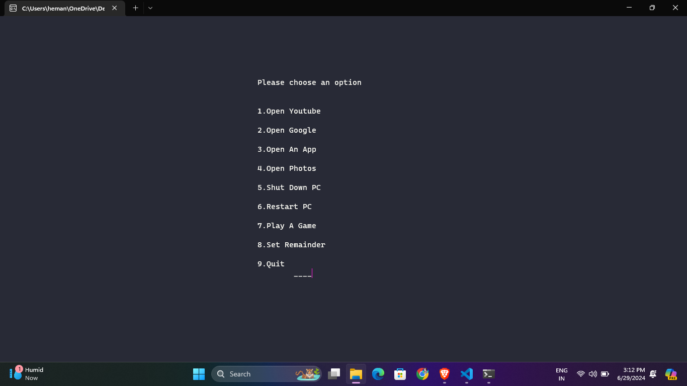

# Jarvis AI Assistant 🤖

Welcome to the Jarvis AI Assistant project! This AI assistant is designed to help you with various tasks on your Windows computer, such as opening applications, setting reminders, playing games, and more.

## Features ✨

- **Voice Assistance**: Jarvis can speak to you using the `espeak` library.
- **Greet Based on Time**: Jarvis greets you based on the current time of day.
- **Open Applications**: Jarvis can open various applications like YouTube, Google, MS Office apps, and more.
- **Set Reminders**: Set a reminder for a specific time.
- **Play Games**: Enjoy a game of Snake, Water, and Gun.
- **System Control**: Shutdown or restart your computer via voice command.

## Screenshots

### Main Menu

